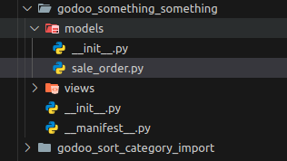

# Odoo Module Creator

Este script Python ajuda a gerar um módulo Odoo básico, incluindo arquivos essenciais como modelos, visões, arquivos de inicialização e manifesto. O script cria os diretórios necessários, configura os arquivos com as informações fornecidas e abre o arquivo Python do modelo no VSCode para facilitar o desenvolvimento.

## Pré-requisitos

- **Python 3.x**  
  O script requer a versão 3.x do Python para funcionar corretamente.

- **VSCode**  
  O script utiliza o comando `code` para abrir arquivos no Visual Studio Code.

## Instalar dependências

Para instalar as dependências necessárias, crie um ambiente virtual ou use o Python global e execute o seguinte comando:

```pip install -r requirements.txt```


Configuração do ambiente

Antes de executar o script, você precisa configurar um arquivo .env contendo as variáveis de ambiente necessárias para o script. Essas variáveis definem os caminhos de destino onde o módulo será gerado, no projeto existe um arquivo chamado env.example , apos a configuração troque o nome dele para .env

use o caminho absoluto como preferencia

Exemplo de arquivo:

```ini
DESTINO_VSCODE_SYLVIA=/caminho/para/o/vscode/sylvia
DESTINO_MODULOS_SYLVIA=/caminho/para/o/modulo/sylvia

DESTINO_VSCODE_ASISTO_BASE=/caminho/para/o/vscode/asisto-base
DESTINO_MODULOS_ASISTO_BASE=/caminho/para/o/modulo/asisto-base

DESTINO_VSCODE_NAVE=/caminho/para/o/vscode/nave
DESTINO_MODULOS_NAVE=/caminho/para/o/modulo/nave
```
Uso

``` python3 app.py```


### O que o script faz

1. **Criação da estrutura de diretórios**  
   O script cria automaticamente os diretórios essenciais para o módulo Odoo, como `views/`, `models/`, entre outros, organizando a estrutura do projeto de forma padronizada.

2. **Geração do arquivo Python do modelo**  
   O script gera o arquivo `models/my_model.py`, contendo um esqueleto básico para um modelo Odoo, com as classes e atributos iniciais necessários para começar o desenvolvimento.

3. **Criação do arquivo de visão (XML)**  
   Após gerar o modelo, o script cria um arquivo XML básico para definir a visão (view) associada, permitindo que você conecte o modelo com a interface do usuário no Odoo.

4. **Abertura automática no VSCode**  
   Após a criação dos arquivos, o script abre automaticamente o arquivo Python gerado no VSCode, utilizando o comando `code`, para facilitar a edição e o desenvolvimento imediato.


## Utilização

Para utilizar , preencha os dois campos 


o nome do modulo `godoo_something_something`

o nome dos arquivos python e xml `sale_order`

eles precisam estar separados com " _ " underlines


ao clicar no botão , a seguinte estrutura de pastas sera criada com algumas customizações




